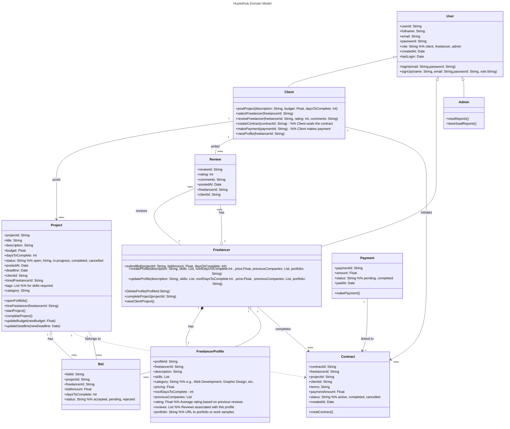

[](https://classroom.github.com/a/DIHvCS29)

# HustleHub

# Video Link

"https://northeastern-my.sharepoint.com/:v:/g/personal/pratapwar_s_northeastern_edu/Eb06YQxIPWpLr-ld1CZRmZoBpYlrLGoFy9SZx5jcpQpa7Q?e=6PhYcY"
## Overview:


## Project Description: 
HustleHub application is a digital platform where clients can post their projects, detailing required skills, timelines, and budgets. Freelancers then browse these listings and communicate with client  to showcase their qualifications for consideration , then freelancers are selected by clients to work on their project. Following project completion, clients  will review and provide feedback to the freelancer.By offering tools for handling contracts and payments, the platform facilitates collaboration.

## Key Features:

- **Easy Project Listings:** Clients can list project details in minutes, including skills required, budgets, and timelines.
-  **Freelancer Discovery:** Freelancers can showcase portfolios, connect with clients, and bid on projects that match their expertise.
- **Secure Payments:** Simplified contracts and escrow-based payment systems ensure safe and timely transactions.
Performance Feedback: Reviews and ratings promote continuous improvement and accountability for both clients and freelancers.
- **Efficient Workflow:** Tools for streamlined bidding, communication, and project delivery.

## Team Name: DevMates
**Team Members:**
1) Divya Prakash: prakash.di@northeastern.edu
2) Priyanka  Basavaraj Bhadrappanavar: bhadrappanavar.p@northeastern.edu
3) Shivani Sugurushetty: sugurushetty.s@northeastern.edu
4) Shriya Pratapwar: pratapwar.s@northeastern.edu
 
 ## Steps to set up .env
This project requires a .env file to store the server port no., your MongoDB connection parameters and jwt , emailjs and stripe keys. This file is ignored by Git to ensure your connection is private.

Two env files need to be setup

Setup at Backend:

1. Create .env file in the root directory of the project 
```bash
mongodb+srv://<db_username>:<db_password>@<cluster>/courseenrollmentdb?retryWrites=true&w=majority&appName=<cluster-name>
PORT=5000
JWT_SECRET=secret-key
```
2. Replace the placeholders with actual data.<br/>
3. Save the file.

Setup at Frontend:

1.Create .envv file in hustlehub directory
```bash
VITE_SERVICE_ID=your_emailjs_service_id
VITE_TEMPLATE_ID=your_emailjs_template_id
VITE_PUBLIC_KEY=your_emailjs_public_key
VITE_STRIPE_PUBLIC_KEY=your_stripe_public_key
```
2. Replace the placeholders with actual data.<br/>
3. Save the file.

## Instructions to execute the project:
1. Clone the repository `git clone https://github.com/info-6150-fall-2024/final-project-devmates.git`
2. Navigate to service directory in local machine and add .env file for MongoDB connection (port: 3000)
3. Execute the command: `node server.js`
4. Open new terminal on project root directory and execute: `cd hustlehub`
5. Execute the command: `npm install`
6. Execute the command: `npm run dev`
7.  Open the localhost link on the browser to view the application

## Object Model for the HustelHub using Domain Driven Design


